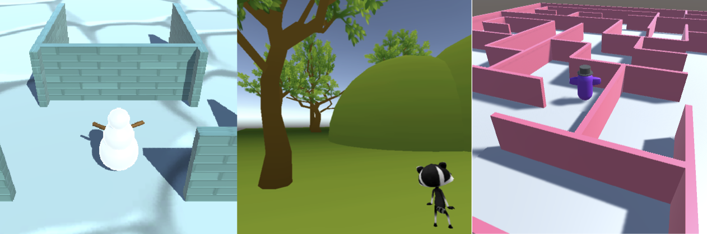
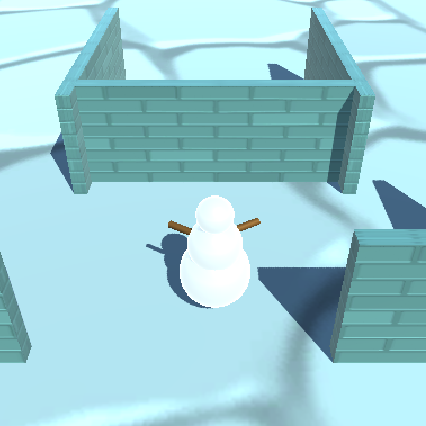

## Introduction

Use your Unity skills to design and build an 3D world with a player character of your choice. 

You will build on this world in the next two projects in the [Introduction to Unity path](https://projects.raspberrypi.org/en/raspberrypi/unity-intro).

**World building** is imagining an environment and then making it come to life. World building can involve storytelling, visual design, map making and character design. In Unity you can imagine a 3D world and then make it so that others can experience it. 

You will:
+ Choose a 3D Player character (use a provided model or make your own from 3D GameObjects)
+ Build a 3D environment using 3D GameObjects and Particle Systems
+ Decide on camera settings and movement controls for your Player character

--- no-print ---

--- task ---

  

### Try it 

Navigate through the world in the example project. Think about the GameObjects including their shape, materials and positions. 
+ Does the character fit the theme? 
+ How have the structures been created? 

[Snow Scene](https://raspberrypilearning.github.io/unity-webgl/SnowSceneWeb/){:target=blank}.

--- /task ---

### Get inspiration 

You are going to make some design decisions to build your world.

--- task ---

Explore these example projects to get more ideas:

[Maze World](https://raspberrypilearning.github.io/unity-webgl/maze_web/){:target=blank}.

--- /task ---
--- /no-print ---

--- print-only ---

### Get inspiration 

You are going to make some design decisions to build your world.

Use these example images to get more ideas:

<mark>  </mark>
<mark>  </mark>

--- /print-only ---

