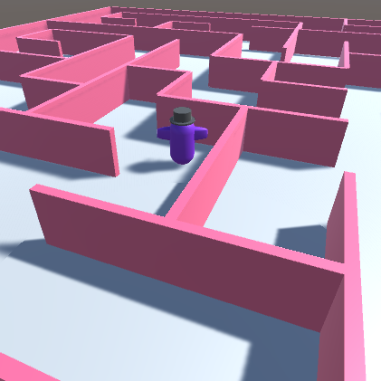

## You will make

Use your Unity skills to design and build a 3D world with a Player character of your choice. 

You will build on this world in the next two projects in the [Introduction to Unity](https://projects.raspberrypi.org/en/raspberrypi/unity-intro){:target='_blank'} pathway.

This project is brought to you with generous support from [Unity Technologies](https://unity.com/){:target="_blank"}.  These [projects](https://projects.raspberrypi.org/en/pathways/unity-intro){:target="_blank"} offer young people the opportunity to take their first steps in creating virtual worlds using Real-Time 3D.

**World building** is imagining an environment and then making it come to life. World building can involve storytelling, visual design, map making, and character design. In Unity you can imagine a 3D world and then make it so that others can experience it. 

You will:
+ Choose a 3D Player character (use a provided model or make your own from 3D GameObjects)
+ Build a 3D environment using 3D GameObjects and Particle Systems
+ Decide on camera settings and movement controls for your Player character

--- no-print ---

### Play ▶️

--- task ---

  

Click on the embedded project and navigate through the example world. 

Think about the GameObjects, including their shape, materials, and positions. 
+ Does the character fit the theme? 
+ How have the structures been created? 

[Snow scene](https://raspberrypilearning.github.io/unity-webgl/SnowSceneWeb){:target='_blank'} 

<iframe allowtransparency="true" width="710" height="450" src="https://raspberrypilearning.github.io/unity-webgl/SnowSceneWeb" frameborder="0"></iframe>

{:width="400px"}

--- /task ---

### Get ideas 💭

You are going to make some design decisions to build your world.

--- task ---

Explore these example projects to get more ideas:

[Try the Maze world](https://raspberrypilearning.github.io/unity-webgl/maze-world-builder){:target='_blank'}.
{:width="400px"}

[Try the Hills and trees world](https://raspberrypilearning.github.io/unity-webgl/HillsandTrees){:target='_blank'}.
{:width="400px"}

--- /task ---

--- /no-print ---

--- print-only ---

### Get ideas 💭 

You are going to make some design decisions to build your world.

Explore these example projects to get more ideas:

Snow scene: https://raspberrypilearning.github.io/unity-webgl/SnowSceneWeb
{:width="400px"}
Maze world: https://raspberrypilearning.github.io/unity-webgl/maze-world-builder
{:width="400px"}
Hills and trees: https://raspberrypilearning.github.io/unity-webgl/HillsandTrees
{:width="400px"}

--- /print-only ---

To explore how these projects have been made, download and unzip the [Unity packages](https://rpf.io/p/en/world-builder-get){:target='_blank'} then import each one into an new 3D Unity project. 

[[[unity-create-3d-project]]]

[[[unity-importing-a-package]]]
