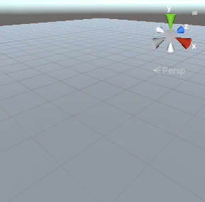
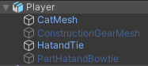
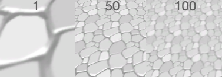

## Theme your world

What will your world be like? The material you choose for the ground will set the scene and you will choose or create a player character. 

{:width="300px"}

--- task ---
Think about the kind of world you want to make: 

+ What kind of biome, habitat, geography or weather system will it have?
+ Will it be based on somewhere in the real world, an imagined planet, or based on a book or movie you enjoy?

Think of a **name** for your world. 

--- /task ---

--- task ---
Open your Introduction to Unity project containing the scenes you created in the three Explore projects in this path. 

--- /task ---

--- task ---

**Choose:**

You can either create a new empty scene in the project, or save a copy of your Non-player character scene with a new name. 

Name the new scene with the name of your world. 

--- collapse ---

---
title: Create a new scene
---

Select 'File' then 'New Scene'. 

--- /collapse ---

--- collapse ---

---
title: Save a copy of an existing scene
---

Right-click on your NPC scene and choose 'Save As'. 

Delete any GameObjects that you don't want in your new world. If you think you might want to use a GameObject later, you can deactivate it by unchecking the box next to its name in the Inspector. 

--- /collapse ---

--- /task ---

Your world or map will need a floor or ground for the player to walk on.

--- task ---
If you're starting from a new scene, add a plane for the floor. If you're working on an existing scene you can just change the material or size.

--- collapse ---

---
title: Add a plane
---

Right-click on your scene in the Hierarchy and select 'GameObject' then '3D Object' then 'Plane'. 

The default size for the plane is 10m x 10m. Unity uses metres as the unit of measurement.

You can change the X and Z Scale properties for the Plane's Transform in the Scene view or in the Inspector. 

--- /collapse ---

Add or change the material for the plane to fit with the world you are designing.

[[[unity-material-with-texture]]]

--- collapse ---

---
title: Add a material to a GameObject
---

To add a material to a GameObject, navigate to the material in the Model window and drag the material over the GameObject in the scene view. The new material will be applied immediately. 

--- /collapse ---

You can adjust the **Tiling** and other properties in the Inspector for the Material, or in the Inspector for each GameObject that uses the texture. Experiment to get a result you like!

--- /task ---

What kind of character will the Player be in your world? We have included some animal and car mdoel objects that you can choose from. Alternatively you can make a character from a 3D GameObject with child objects that move together. 

--- task ---

If you made a copy of an existing scene but want a different player character:
+ Drag the Main Camera from the existing Player to the top level in the Hierarchy, then
+ Delete the Player GameObject. 

Models can be created in 3D modelling tools such as Blender. You can also reuse existing Models if you have permission. To save time, we recommend that you use one of the models we have provided, or design your own GameObject using 3D shapes in Unity.

**Choose:**

--- collapse ---

---
title: Create a GameObject from a model
---

Navigate to the Model you want to use in the Project window. 

Drag the model to your scene. 

Name the new GameObject 'Player' and add the 'Player' tag. 

Adjust the start position of the Player's transform. 

If you use the Cat or Raccoon then decide which accessories you will enable and disable the others by unchecking the box next to their name in the Inspector.

--- /collapse ---

--- collapse ---

---
title: Create a GameObject from 3D shapes
---

Add a '3D Object' to your scene to represent the player. 

Name the new GameObject 'Player' and add the 'Player' tag.  

Right-click on the Player and add other 3D shapes from 'Create' -> '3D Object' as child game objects. The child objects will move with the Player GameObject. 

This character has a 'Capsule' body with child GameObjects that are 'Spheres', and 'Cylinders'. The shapes have been renames to represent their body part. 

{:width="400px"}

--- /collapse ---

--- /task ---

--- task ---

**Debug:**

--- collapse ---

---
title: The material texture is too big or small
---

You can change the **Tiling** properties for the Material, or for a material used in a GameObject. Choose bigger tiling numbers to create a smaller pattern.

--- /collapse ---

--- collapse ---

---
title: I deleted the Camera!
---

If your camera is a child of the Player and you delete the Player then you will also delete the Camera.

To add a new Camera, right-click in the Hierarchy and choose Camera. 

You can drag this Camera to be a child of your Player and adjust the settings. 

--- /collapse ---

--- /task ---

--- save ---
