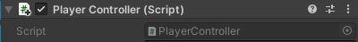
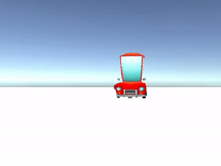

## Player controls

The player needs to be able to control your character so that they can move around your world. 

{:width="300px"}

--- task ---

**Choose:** How will your player move?
+ If you have chosen the Cat or Raccoon model then you can reuse your 'PlayerController' movement script and 'IdleWalk' animator. 
+ If you have chosen the Car01 or Car02 model you can reuse your 'PlayerController' movement script and use the matching Car1 or Car2 animators.
+ If you have created your own Player then you can create your own simple movement script without animation. 

--- collapse ---

---
title: Reuse your PlayerController script for a Cat or Raccoon
---

Select your Player GameObject and then click 'Add Component' in the Inspector and choose 'Character controller'.

Find your IdleWalk Animator in the Project window, select the Player GameObject and drag the Animator to the Inspector. 

Find your PlayerController script in the Project window, select the Player GameObject and drag the script to the Inspector. 

**Tip:** You can also drag the Script and Animator from the Project window to the Player GameObject in the Hierarchy. Just be careful to drag it to the correct GameObject. 

<mark>Mention the specific folder location of these Assets when we finalise it.</mark>

--- /collapse ---

[[[unity-player-character-controller]]]

[[[unity-animation]]]

--- /task ---

--- task ---

**Test:** Try moving around in Playmode and make sure your character can move around. 

Adjust the speed settings to get the right effect for your character. 

**Tip:** If you change the speed properties in the Inspector then those values will be used instead of the defaults. Default values are useful if you want to reuse the script in other scenes or projects. 

[[[unity-console-error]]]

--- collapse ---

---
title: My character isn't moving
---

+ Check that you are in Playmode with the green tint and you have the mouse cursor over the Game view. 
+ Check for any errors in the Console. If there are errors in GameObjects you are not using, such as NPCs, then you could delete the NPCs (you can copy them from another scene if you want them later.)
+ Make sure that the SimpleController script is attached to the Player GameObject (and not a different GameObject). 

--- /collapse ---

--- /task ---

--- task ---

You don't have to make the camera follow the player, but it often makes sense. 

[[[unity-camera-follow-player]]]

--- /task ---

--- task ---
**Test:** Play your scene and make sure the camera follows the Player. 

You may want to adjust the camera settings later when you have your scenery in place. 

--- /task ---

--- task ---
**Debug:**

Useful debug tips:
- Turn on the Playmode tint so that you can tell when you are in game mode.
- Click on 'Gizmos' in Playmode and then click on a game object in the Inspector to view its colliders.
- Look at the values of public variables in the Inspector in Playmode to see how they are changing. 
- Use `Debug.Log()` to print messages to the Console to understand what's happening. 
- Check the Console for errors. Script errors also appear in the bar at the bottom of the editor. 

[[[unity-camera-error]]]

[[[unity-changes-gone]]]

[[[unity-method-absent]]]

[[[unity-show-variables]]]

--- /task ---

--- save ---