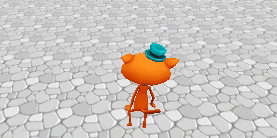
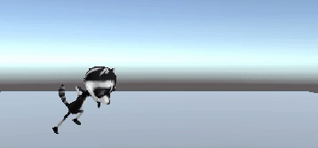

## Player controls

The player needs to be able to control your character so that they can move around your world. 

{:width="300px"}

--- task ---

**Choose:** If you have chosen the Cat or Raccoon model then you can reuse your PlayerController movement script and IdleWalk animator. If you have chosen a Car or made your own Player then you can create your own simple movement script without animation. 

--- collapse ---

---
title: Reuse your PlayerController script for a Cat or Raccoon
---

Select your Player GameObject and then click 'Add Component' in the Inspector and choose 'Character controller'.

Find your IdleWalk Animator in the Project window, select the Player GameObject and drag the Animator to the Inspector. 

Find your PlayerController script in the Project window, select the Player GameObject and drag the script to the Inspector. 

**Tip:** You can also drag the Script and Animator from the Project window to the Player GameObject in the Hierarchy. Just be careful to drag it to the correct GameObject. 

<mark>Mention the specific folder location of these Assets when we finalise it.</mark>

--- /collapse ---

[[[unity-player-character-controller]]]

--- /task ---

--- task ---
**Test:** Try moving around in Playmode and make sure your character can move around. 

Adjust the speed settings to get the right effect for your character. 

**Tip:** If you change the speed properties in the Inspector then those values will be used instead of the defaults. Default values are useful if you want to reuse the script in other scenes or projects. 

--- collapse ---

---
title: My character isn't moving
---

+ Check that you are in Playmode with the green tint and you have the mouse cursor over the Game view. 
+ Check for any errors in the Console. If there are errors in GameObjects you are not using, such as NPCs, then you could delete the NPCs (you can copy them from another scene if you want them later.)
+ Make sure that the SimpleController script is attached to the Player GameObject (and not a different GameObject). 

--- /collapse ---

--- /task ---

--- task ---

You don't have to make the camera follow the player, but it often makes sense. 

[[[unity-camera-follow-player]]]

--- /task ---

--- task ---
**Test:** Play your scene and make sure the camera follows the Player. 

You may want to adjust the camera settings later when you have your scenery in place. 

--- /task ---

--- task ---
**Debug:**

--- collapse ---

---
title: The camera is not following the player
---

Make sure the Main Camera is a child object of the Player Game Object. 

--- /collapse ---

--- /task ---

--- save ---