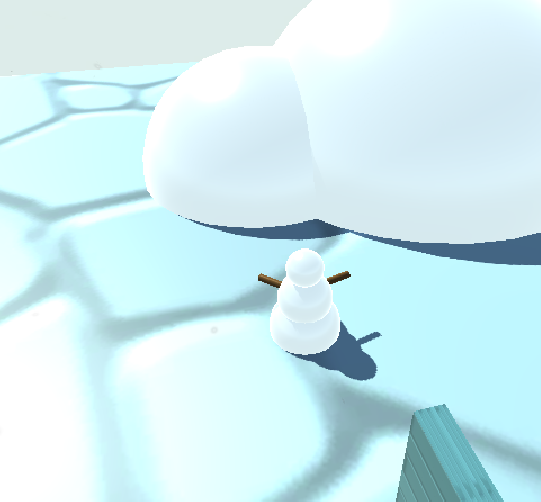
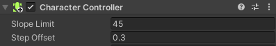
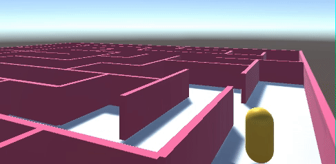

## Build scenery

Now you can build out the map of your world with scenery and particle systems. 

{:width="300px"}

--- task ---

Use 3D shapes to add steps or hills to your world to create different levels for your player to explore. 

--- /task ---

--- task ---

The 'Character Controller' component has properties that allow the character to walk up slopes and steps. 

--- collapse ---

---
title: Steps and slopes with the Character Controller
---

The Character Controller allows a GameObject to move up slopes and steps. 

You can adjust the settings to control the behaviour:
+ **Slope Limit** - The character will walk up slopes that are less than this number of degrees. 
+ **Step Offset** - The character will walk up steps that are less than this height. 

The default settings will be fine for many situations. 

**Tip:** Walking on surfaces is based on colliders, not on the visible parts of the GameObject. If you get unusual behaviour then click on Gizmos in the Game view to view the colliders as you test your game. 

--- /collapse ---

--- /task ---

--- task ---

**Test:** Play your scene and try walking up the slopes or steps you created. 

Adjust the Character Controller settings or your scenery to get the effect you want. 

**Debug:**

--- collapse ---

---
title: My character is walking in the air!
---

Walking on surfaces is based on colliders, not on the visible parts of the GameObjects. If you get unusual behaviour then click on Gizmos in the Game view to view the colliders as you test your game. 

Adjust the colliders so that the character can get close enough to the surface to walk on it. 

--- /collapse ---

--- /task ---

--- task ---
Now add some scenery to your world.

You can use the models we have provided, 3D Objects or a combination. 

[unity-3d-objects]

--- collapse ---

---
title: Add 3D Objects to a scene
---

You can add spheres, cubes, cylinders and other 3D shapes to a scene. 

Right-click in the Hierarchy and choose '3D Object' and then the shape of your choice. 

You can also right-click on a shape in the Hierarchy and add more shapes as child objects. You can position child objects relative to the parent so that they will move with the parent if you reposition it. 

--- /collapse ---

--- collapse ---

---
title: Add a material to a GameObject
---

To add a material to a GameObject, navigate to the material in the Model window and drag the material over the GameObject in the scene view. The new material will be applied immediately. 

--- /collapse ---

We have included Car, Tree and other models that could be used as scenery in your world. 

--- collapse ---

---
title: Add model objects to a scene
---

Navigate to a model in the Project window then drag it to the Scene view to add it to your scene. 

You can adjust the Transform of the GameObjects you create to change their position, rotation and scale (size).

--- /collapse ---

[[[unity-scene-top-down]]]

[[[unity-scene-navigation]]]

--- /task ---

--- task ---
**Test:** Play your scene and walk around. You might want to adjust the camera angle to work well with the scenery you've chosen. 

--- /task ---

Particle Systems are a great way to make your world come to life. 

--- task ---
Consider whether particle effects could make your world more interesting. They can be used to make objects sparkle, to create weather effects, to make a volcano errupt. 

--- collapse ---

---
title: Add a Particle System
---

Particle Systems use lots of small images to create graphical effects that make a 3D world come alive. 

Click in the Inspector and choose 'Effects' -> 'Particle System' to add a particle effect to your world. You can also add a Particle System as a child of another GameObject if that makes sense. 

There are lots of settings you can experiment with to get different particle effects. 

Try adjusting these settings:
+ **Start Color** - Click on the colour to choose the colour for your particles. 
+ **Start Speed** - Control how fast your particles move. 
+ **Start Size** - Control the size of each particle. 
+ **Gravity Modifier** - Set to a positive number if you want your particles to fall to the ground. 
+ **Shape** - Controls the shape that particles appear from. The default is a Cone shape but it might make more sense for your particles to appear in a Sphere or a Cube area. 
+ **Max Particles** - The maximum number of particles that will be active at the same time. 

<mark>It would be good if we could include some specific examples such as snow, smoke, volcano erupting.</mark>

--- /collapse ---

--- /task ---

Background music is another way to add atmosphere to a world. 

--- task ---

The DeathLoop and MenuTheme sounds are suitable for background music. 

<mark>Update if we add more or rename these.</mark>

--- collapse ---

---
title: Add looping background music
---

Background music can be attached to any GameObject, you could choose the floor plane, or the Player. 

Select a GameObject and choose 'Add Component' and then 'Audio Source'. Click on the circle next to AudioClip and choose your music. 

Make sure 'Play on Awake' is selected to automatically play the music and check the 'Loop' box to play the music repeatedly in a loop.

--- /collapse ---

<mark>Would be better if we had a choice of music.</mark>

--- /task ---

<mark>Could also add skybox ingredient</mark>

--- task ---

**Debug:**

--- collapse ---

---
title: Make the camera view isn't working for the scene 
---

Adjust the Tranform position and rotation of the camera to get the camera view that you want. 

--- /collapse ---

--- /task ---

--- save ---