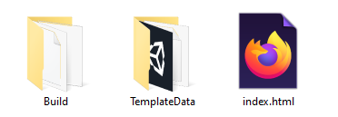

## Share

If you are in a club, why not share your project with friends?

You could also show your family how your project works.

You can build your project as a 'WebGL' project and upload it to a website so others can try it out. 

[[[webgl-setup]]]

[[[webgl-build]]]

### Sharing your WebGL project

In the location where you chose to save your project you should see an `index.html` file, a `Build` directory and a `Template` directory.

Save these files to your preferred storage service (Google Drive, Dropbox, USB Drive)

You could also take a screenshot or make a video of your project. 

You could also take a screenshot or make a video of your project. 

--- task ---

Inspire others with your project by submitting it to our community gallery! 

To share your project with others who make the '3D adventure' project, please complete [this form](https://form.raspberrypi.org/f/community-project-submissions){:target='_blank'}.

--- /task ---
