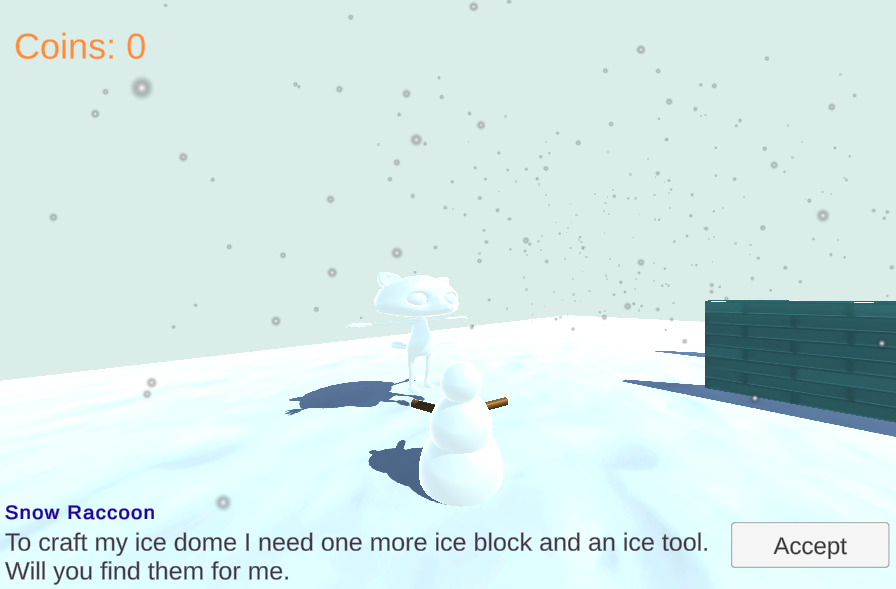

## What next?

If you are following the [Introduction to Unity](https://projects.raspberrypi.org/en/raspberrypi/unity-intro) path, you can move on to the [Quest seeker](https://projects.raspberrypi.org/en/projects/quest-seeker) project. In this project, you will make minigame or story with NPCs that give the player quests to complete.

--- print-only ---

Snow scene: https://raspberrypilearning.github.io/unity-webgl/SnowQuest

--- /print-only ---

--- no-print ---

[Snow Scene](https://raspberrypilearning.github.io/unity-webgl/SnowQuest/){:target=blank}.
{:width="400px"}

--- /no-print ---

