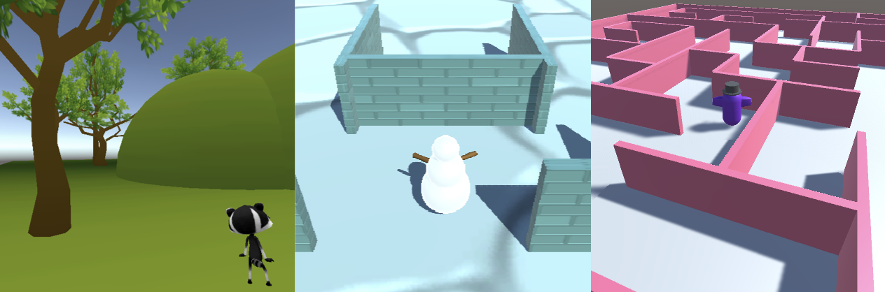

## Ce que tu vas faire

Utilise tes compétences Unity pour concevoir et construire un monde en 3D avec un personnage joueur de ton choix.

Tu t'appuieras sur cet univers dans les deux prochains projets du parcours [Introduction à Unity](https://projects.raspberrypi.org/fr-FR/raspberrypi/unity-intro){:target='_blank'}.

Ce projet t'est présenté grâce au soutien généreux de [Unity Technologies](https://unity.com/){:target="_blank"}.  Ces [projets](https://projects.raspberrypi.org/fr-FR/pathways/unity-intro){:target="_blank"} proposent aux jeunes de faire leurs premiers pas dans la création de mondes virtuels en 3D temps réel.

**World building**, c'est imaginer un environnement puis lui donner vie. Le World building peut impliquer la narration, la conception visuelle, la réalisation de cartes et la conception de personnages. Dans Unity, tu peux imaginer un monde en 3D et le rendre accessible à d'autres personnes. 

Tu vas :
+ Choisir un personnage joueur 3D (utilise un modèle fourni ou crée le tien à partir de 3D GameObjects)
+ Construire un environnement 3D en utilisant des 3D GameObjects et des Particle Systems
+ Décider des paramètres de la caméra et des contrôles de mouvement pour ton personnage joueur

--- no-print ---

### Joue ▶️

--- task ---

Clique sur le projet intégré et navigue dans l'exemple de monde.

Réfléchis aux GameObjects, notamment à leur forme, à leur matériau et à leur position.
+ Le personnage est-il adapté au thème ?
+ Comment les structures ont-elles été créées ?

[Snow scene](https://raspberrypilearning.github.io/unity-webgl/SnowSceneWeb){:target='_blank'} 

<iframe allowtransparency="true" width="710" height="450" src="https://raspberrypilearning.github.io/unity-webgl/SnowSceneWeb" frameborder="0"></iframe>

{:width="400px"}

--- /task ---

### Trouver des idées 💭

Tu vas prendre des décisions de conception pour construire ton monde.

--- task ---

Explore ces exemples de projets pour obtenir plus d'idées :

[Essaie Maze world](https://raspberrypilearning.github.io/unity-webgl/maze-world-builder){:target='_blank'}. 
{:width="400px"}

[Essaie Hills and trees world](https://raspberrypilearning.github.io/unity-webgl/HillsandTrees){:target='_blank'}. 
{:width="400px"}

--- /task ---

--- /no-print ---

--- print-only ---

### Trouver des idées 💭

Tu vas prendre des décisions de conception pour construire ton monde.

Explore ces exemples de projets pour obtenir plus d'idées :

Snow scene : https://raspberrypilearning.github.io/unity-webgl/SnowSceneWeb
{:width="400px"}
Maze world : https://raspberrypilearning.github.io/unity-webgl/maze-world-builder 
{:width="400px"}
Hills and trees : https://raspberrypilearning.github.io/unity-webgl/HillsandTrees 
{:width="400px"}

--- /print-only ---

Pour découvrir comment ces projets ont été réalisés, télécharge et décompresse les [packages Unity](https://rpf.io/p/fr-FR/world-builder-get){:target='_blank'} puis importe chacun d'entre eux dans un nouveau projet 3D Unity.

[[[unity-create-3d-project]]]

[[[unity-importing-a-package]]]
