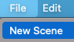
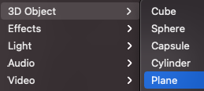
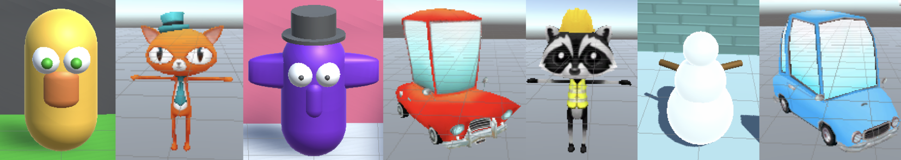
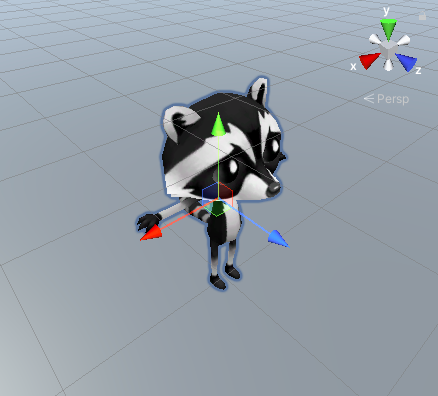
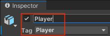
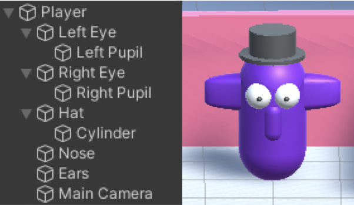

## Thématiser ton monde

À quoi ressemblera ton monde ? Le matériau que tu choisiras définira la scène et tu choisiras ou créeras un personnage joueur. 

{:width="300px"}

--- task ---

Réfléchis au type de monde que tu veux créer :

+ Quel type de biome, d'habitat, de géographie ou de système météorologique aura-t-il ?
+ Sera-t-il basé sur un endroit du monde réel, sur une planète imaginaire, ou sur un livre ou un film que tu aimes ?

Réfléchi à un **nom** pour ton monde.

--- /task ---

--- task ---

**Choisir :**

Ouvre ton projet d'introduction à Unity contenant les scènes que tu as créées dans les trois projets Explorer de ce parcours.

Ou

Télécharge et décompresse le [package de démarrage Unity](https://rpf.io/p/fr-FR/world-builder-go){:target="_blank"} sur ton ordinateur. Choisis un emplacement judicieux, par exemple ton dossier Documents. Crée un nouveau projet 3D Unity et importe le package de démarrage.

[[[unity-create-3d-project]]]

[[[unity-importing-a-package]]]

--- /task ---

--- task ---

**Choisir :**

Tu peux soit créer une nouvelle scène vide dans le projet, soit enregistrer une copie de ta scène Collectionneur d'étoiles avec un nouveau nom.

Nomme la nouvelle scène avec le nom de ton monde.

--- collapse ---

---
title: Créer une nouvelle scène
---

Sélectionne **File** puis **New Scene**.

--- /collapse ---

--- collapse ---

---
title: Enregistrer une copie d'une scène existante
---

Fais un clic droit sur ton **NPC scene** et choisis **Save As**.

Supprime tous les GameObjects que tu ne veux pas dans ton nouveau monde. Si tu penses vouloir utiliser un GameObject plus tard, tu peux le désactiver en décochant la case à côté de son nom dans l'Inspector.

--- /collapse ---

--- /task ---

Ton monde ou ta carte aura besoin d'un sol sur lequel le joueur pourra marcher.

--- task ---

Si tu pars d'une nouvelle scène, ajoute un plan pour le sol. Si tu travailles sur une scène existante, tu peux simplement changer le matériau ou la taille.

--- collapse ---

---
title: Ajouter un plan
---

Fais un clic droit sur ta scène dans la fenêtre Hierarchy et sélectionne **GameObject** puis **3D Object** puis **Plane**.

La taille par défaut du plan est de 10 m × 10 m. Unity utilise le mètre comme unité de mesure.

Tu peux modifier les propriétés x et z Scale pour le Transform du plan dans la vue Scene ou dans l'Inspector.

--- /collapse ---

[[[unity-terrain-object]]]

Ajoute ou modifie le matériau de l'avion pour qu'il corresponde au monde que tu es en train de concevoir.

[[[unity-material-with-texture]]]

--- /task ---

Quel genre de personnage le joueur sera-t-il dans ton monde ? Nous avons inclus des objets de modèles d'animaux et de voitures parmi lesquels tu peux choisir. Tu peux aussi créer un personnage à partir d'un 3D GameObject avec des objets enfants qui se déplacent ensemble.

--- task ---

Si tu as fait une copie d'une scène existante mais que tu veux un personnage différent :
+ Fais glisser la Main Camera du joueur existant jusqu'au niveau supérieur dans Hierarchy, puis
+ Supprime le GameObject Player.

Les modèles peuvent être créés dans des outils de modélisation 3D tels que Blender. Tu peux aussi réutiliser des modèles existants si tu en as l'autorisation. Pour gagner du temps, nous te recommandons d'utiliser l'un des modèles que nous avons fournis, ou de concevoir ton propre GameObject en utilisant des formes 3D dans Unity.

**Choisir :**

--- collapse ---

---
title: Créer un GameObject à partir d'un modèle
---

Va jusqu'au modèle que tu veux utiliser dans la fenêtre Project.

Fais glisser le modèle sur ta scène.

Nomme le nouveau GameObject `Joueur` et ajoute le tag Joueur.

Ajuste la position de départ du Transform du joueur.

Si tu utilises Cat ou Raccoon, décide des accessoires que tu vas activer, puis désactive les autres en décochant la case à côté de leur nom dans l'Inspector.

--- /collapse ---

--- collapse ---

---
title: Créer un GameObject à partir de formes 3D
---

Crée un objet 3D « Empy » pour représenter le joueur.

Nomme le nouveau GameObject `Joueur` et ajoute le tag Joueur.

Fais un clic droit sur le joueur et ajoute d'autres formes 3D à partir de **Create** > **3D Object** en tant que GameObjects enfants. Les objets enfants se déplacent en même temps que le GameObject Joueur.

Ce personnage a un corps « Capsule » avec des GameObjects enfants qui sont des « Spheres » et des « Cylinders ». Les formes ont été renommées pour représenter leur partie du corps.

{:width="400px"}

--- /collapse ---

--- /task ---

--- task ---

**Déboguer :**

[[[unity-assign-material]]]

--- collapse ---

---
title: La texture du matériau est trop grande ou trop petite
---

Tu peux modifier les propriétés **Tiling** pour le matériau, ou pour un matériau utilisé dans un GameObject. Choisis des nombres de carreaux plus importants pour créer un motif plus petit.

--- /collapse ---

--- collapse ---

---
title: J'ai supprimé la caméra !
---

Si ta caméra est un enfant du joueur et que tu supprimes le joueur, tu supprimeras également la caméra.

Pour ajouter une nouvelle caméra, fais un clic droit dans Hierarchy et choisis Camera.

Tu peux faire glisser cette caméra pour qu'elle devienne un enfant de ton joueur et ajuster les paramètres.

--- /collapse ---

--- /task ---

--- save ---
