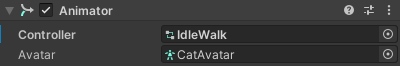
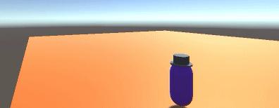

## Contrôles du joueur

Le joueur doit pouvoir contrôler ton personnage pour qu'il puisse se déplacer dans ton monde. 

{:width="300px"}

--- task ---

**Choisir :** Comment ton joueur se déplacera-t-il ?
+ Si tu as choisi le modèle Cat ou Raccoon, tu peux alors réutiliser ton script de mouvement PlayerController et l'animator IdleWalk.
+ Si tu as choisi le modèle Car01 ou Car02, tu peux réutiliser ton script de mouvement PlayerController et utiliser les animators Car1 ou Car2 correspondants.
+ Si tu as créé ton propre joueur, tu peux alors créer ton propre script de mouvement simple sans animation.

--- collapse ---

---
title: Ajouter le script PlayerController pour Cat, Raccoon ou Rat
---

Sélectionne ton **GameObject Joueur** puis clique sur **Add Component** dans l'Inspector et choisis **Character Controller**.

Trouve ton **IdleWalk Animator** dans le dossier Animation de la fenêtre Project, sélectionne le **GameObject Joueur** et fais glisser l'**Animator** vers l'Inspector.

Si tu es parti d'un projet contenant le script PlayerController, tu peux l'ajouter à un nouveau GameObject personnage. Trouve le script **PlayerController** dans la fenêtre Project, sélectionne le **GameObject Joueur** et fais glisser le script vers l'Inspector.

**Astuce :** tu peux aussi faire glisser le script et l'animator de la fenêtre Project vers le GameObject Joueur dans Hierarchy. Fais simplement attention à le faire glisser vers le bon GameObject.

Si tu n'as pas le script PlayerController, alors sélectionne ton **GameObject personnage** et clique sur **Add Component** et crée un script appelé `PlayerController` avec ce script :

--- code ---
---
language: csharp
filename: PlayerController.cs
line_numbers: false
line_number_start: 
line_highlights: 
---
using System.Collections;
using System.Collections.Generic;
using UnityEngine;

public class PlayerController : MonoBehaviour
{
    public float vitesse = 3.0f;
    public float vitesseRotation = 1.0f;
    Animator anim;

    void Start()
    {
        anim = gameObject.GetComponent<Animator>();
    }
    
    void Update()
    {
        float vitesseDeplacement = vitesse;
    
        if (Input.GetAxis("Vertical") > 0)
        {
            anim.SetBool("forward", true);
        }
        else if (Input.GetAxis("Vertical") < 0)
        {
            anim.SetBool("forward", false);
            vitesseDeplacement *= 0.5f;
        }
        else
        {
            anim.SetBool("forward", false);
        }
    
        CharacterController controller = GetComponent<CharacterController>();
        transform.Rotate(0, Input.GetAxis("Horizontal") * vitesseRotation, 0);
        Vector3 forward = transform.TransformDirection(Vector3.forward);
        float vitesseCur = vitesseDeplacement * Input.GetAxis("Vertical");
        controller.SimpleMove(forward * vitesseCur);
    }
}

--- /code ---

--- /collapse ---

[[[unity-player-character-controller]]]

[[[unity-animation]]]

--- /task ---

--- task ---

**Test :** essaie de te déplacer en mode Play et vérifie que ton personnage peut se déplacer.

Ajuste les paramètres de vitesse pour obtenir le bon effet pour ton personnage.

**Astuce :** si tu modifies les propriétés de la vitesse dans l'Inspector, alors ces valeurs seront utilisées à la place des valeurs par défaut. Les valeurs par défaut sont utiles si tu veux réutiliser le script dans d'autres scènes ou projets.

[[[unity-console-error]]]

--- collapse ---

---
title: Mon personnage ne se déplace pas
---

+ Vérifie que tu es en mode Play avec la teinte de couleur et que tu as le curseur de la souris sur la vue Game.
+ Vérifie qu'il n'y a pas d'erreurs dans la console. S'il y a des erreurs dans les GameObjects que tu n'utilises pas, comme les PNJ, alors tu pourrais supprimer les PNJ (tu peux les copier d'une autre scène si tu les veux plus tard).
+ Assure-toi que le script SimpleController est attaché au GameObject Joueur (et non à un GameObject différent).
+ Assure-toi que le nom du paramètre utilisé pour l'Animator est le même que le nom du paramètre dans ton script. Dans l'exemple ci-dessus, `court` est utilisé comme nom de paramètre.

--- /collapse ---

--- /task ---

--- task ---

Tu n'es pas obligé de faire en sorte que la caméra suive le joueur, mais cela a souvent du sens.

[[[unity-camera-follow-player]]]

--- /task ---

--- task ---

**Test :** joue ta scène et vérifie que la caméra suit bien le joueur.

Tu voudras peut-être ajuster les paramètres de la caméra plus tard, lorsque ton paysage sera en place.

--- /task ---

--- task ---

**Déboguer :**

Astuces de débogage utiles :
- Active la teinte du mode Play pour que tu puisses savoir quand tu es en mode Game.
- Clique sur **Gizmos** en mode Play, puis clique sur un GameObject dans l'Inspector pour afficher ses colliders.
- Regarde les valeurs des variables publiques dans l'Inspector en mode Play pour voir comment elles changent.
- Utilise `Debug.Log()` pour imprimer des messages sur la console afin de comprendre ce qui se passe.
- Vérifie qu'il n'y a pas d'erreurs dans la console. Les erreurs de script apparaissent également dans la barre située en bas de l'éditeur.

[[[unity-camera-error]]]

[[[unity-changes-gone]]]

[[[unity-method-absent]]]

[[[unity-show-variables]]]

--- /task ---

--- save ---
