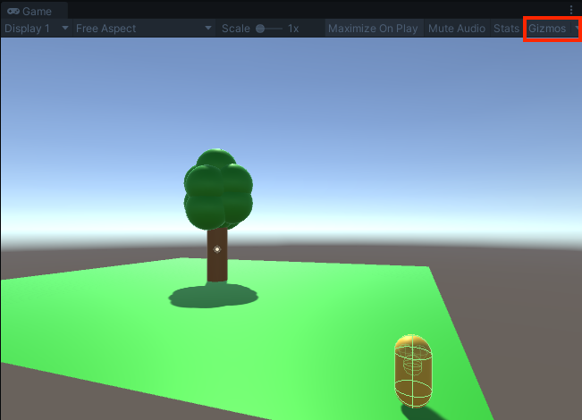
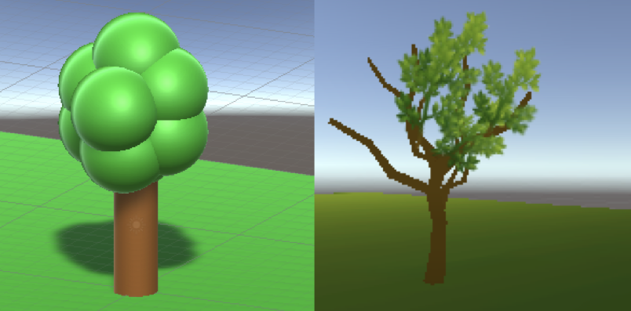
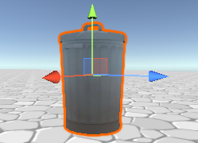
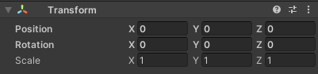

## Créer un décor

Tu peux maintenant créer la carte de ton monde avec des décors et des systèmes de particules. 

{:width="300px"}

--- task ---

Utilise des formes 3D pour ajouter des marches ou des collines à ton monde afin de créer différents niveaux que ton joueur pourra explorer.

--- /task ---

--- task ---

Le composant Character Controller possède des propriétés qui permettent au personnage de monter des pentes et des marches.

--- collapse ---

---
title: Marches et pentes avec le Character Controller
---

Le Character Controller permet à un GameObject de se déplacer sur des pentes et des marches.

Tu peux ajuster les paramètres pour contrôler le comportement :
+ **Slope Limit** : le personnage montera des pentes inférieures à ce nombre de degrés.
+ **Step Offset** : le personnage montera des marches inférieures à cette hauteur.

Les paramètres par défaut conviennent à de nombreuses situations.

**Astuce :** la marche sur les surfaces est basée sur les colliders, et non sur les parties visibles du GameObject. Si tu obtiens un comportement inhabituel, clique alors sur Gizmos dans la vue Game pour voir les colliders pendant que tu testes ton jeu.

--- /collapse ---

--- /task ---

--- task ---

**Test :** joue ta scène et essaie de monter les pentes ou les marches que tu as créées.

Ajuste les paramètres du Character Controller ou ton paysage pour obtenir l'effet que tu souhaites.

**Déboguer :**

--- collapse ---

---
title: Mon personnage marche dans les airs !
---

La marche sur les surfaces est basée sur les colliders, et non sur les parties visibles des GameObjects. Si tu obtiens un comportement inhabituel, clique alors sur Gizmos dans la vue Game pour voir les colliders pendant que tu testes ton jeu.

Ajuste les colliders de manière à ce que le personnage puisse s'approcher suffisamment de la surface pour marcher dessus.

Si tu crées une sphère, elle aura un collider sphère, alors règle l'échelle x, y et z sur le même nombre.

--- /collapse ---

--- /task ---

--- task ---

Maintenant, ajoute un peu plus de décor à ton monde.

Tu peux utiliser les modèles que nous avons fournis, des objets en 3D, ou une combinaison des deux.

[[[unity-3d-objects]]]

[[[unity-material-with-texture]]]

Nous avons inclus des modèles de voitures, d'arbres et d'autres modèles qui pourraient être utilisés comme décor dans ton monde.

--- collapse ---

---
title: Ajouter des objets de modèle à une scène
---

Va vers un modèle dans la fenêtre Project, puis fais-le glisser vers la vue Scene pour l'ajouter à ta scène.

Tu peux ajuster le Transform des GameObjects que tu crées pour modifier leur position, leur rotation et leur échelle (taille).

--- /collapse ---

[[[unity-scene-top-down]]]

[[[unity-scene-navigation]]]

[[[unity-physics-colliders]]]

--- /task ---

--- task ---

**Test :** joue ta scène et promène-toi. Tu voudras peut-être ajuster l'angle de la caméra pour qu'elle s'accorde bien avec le décor que tu as choisi.

--- /task ---

Les Particles Systems sont un excellent moyen de donner vie à ton monde.

--- task ---

Demande-toi si les effets de particules pourraient rendre ton monde plus intéressant. Ils peuvent être utilisés pour faire scintiller des objets, pour créer des effets météorologiques ou pour faire entrer un volcan en éruption.

[[[unity-particle-system]]]

--- /task ---

La musique de fond est un autre moyen d'ajouter une atmosphère à un monde.

--- task ---

Les sons MusicLoop1 et MusicLoop2 conviennent pour une musique de fond, ou tu peux ajouter les tiens.

[[[unity-add-soundtrack]]]

[[[unity-import-sounds]]]

--- /task ---

--- task ---

**Déboguer :**

--- collapse ---

---
title: La vue caméra ne fonctionne pas bien pour la scène
---

Ajuste la position Transform et la rotation de la caméra pour obtenir la vue caméra que tu souhaites.

--- /collapse ---

[[[unity-collider-error]]]

--- /task ---

--- save ---
