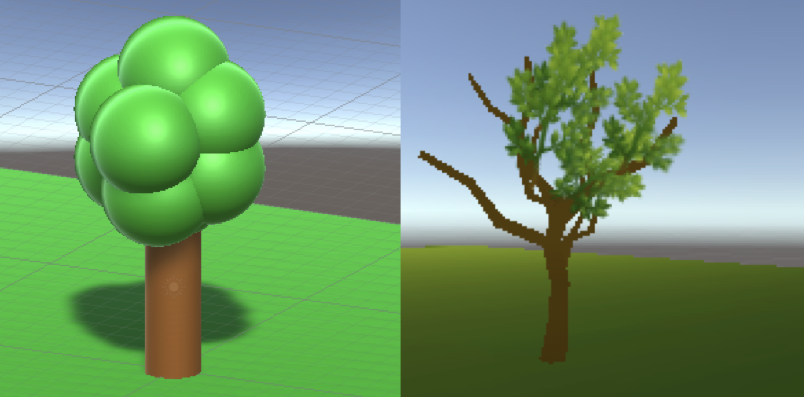
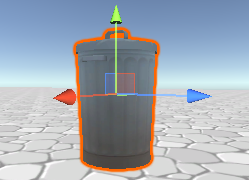

## Build scenery

Now you can build out the map of your world with scenery and particle systems. 

{:width="300px"}

--- task ---

Use 3D shapes to add steps or hills to your world to create different levels for your player to explore.

--- /task ---

--- task ---

The Character Controller component has properties that allow the character to walk up slopes and steps.

--- collapse ---

---
title: Steps and slopes with the Character Controller
---

The Character Controller allows a GameObject to move up slopes and steps.

You can adjust the settings to control the behaviour:
+ **Slope Limit**: The character will walk up slopes that are less than this number of degrees.
+ **Step Offset**: The character will walk up steps that are less than this height.

The default settings will be fine for many situations.

**Tip:** Walking on surfaces is based on colliders, not on the visible parts of the GameObject. If you get unusual behaviour, then click on Gizmos in the Game view to view the colliders as you test your game.

--- /collapse ---

--- /task ---

--- task ---

**Test:** Play your scene and try walking up the slopes or steps you created.

Adjust the Character Controller settings or your scenery to get the effect you want.

**Debug:**

--- collapse ---

---
title: My character is walking in the air!
---

Walking on surfaces is based on colliders, not on the visible parts of the GameObjects. If you get unusual behaviour, then click on Gizmos in the Game view to view the colliders as you test your game.

Adjust the colliders so that the character can get close enough to the surface to walk on it.

If you create a sphere, it will have a sphere collider so set the x, y, and z scale to the same number.

--- /collapse ---

--- /task ---

--- task ---

Now add some scenery to your world.

You can use the models we have provided, 3D objects, or a combination.

[[[unity-3d-objects]]]

[[[unity-material-with-texture]]]

We have included Car, Tree, and other models that could be used as scenery in your world.

--- collapse ---

---
title: Add model objects to a scene
---

Navigate to a model in the Project window, then drag it to the Scene view to add it to your scene.

You can adjust the Transform of the GameObjects you create to change their position, rotation, and scale (size).

--- /collapse ---

[[[unity-scene-top-down]]]

[[[unity-scene-navigation]]]

[[[unity-physics-colliders]]]

--- /task ---

--- task ---

**Test:** Play your scene and walk around. You might want to adjust the camera angle to work well with the scenery you've chosen.

--- /task ---

Particle Systems are a great way to make your world come to life.

--- task ---

Consider whether particle effects could make your world more interesting. They can be used to make objects sparkle, to create weather effects, or to make a volcano errupt.

[[[unity-particle-system]]]

--- /task ---

Background music is another way to add atmosphere to a world.

--- task ---

The MusicLoop1 and MusicLoop2 sounds are suitable for background music, or you can add your own.

[[[unity-add-soundtrack]]]

[[[unity-import-sounds]]]

--- /task ---

--- task ---

**Debug:**

--- collapse ---

---
title: The camera view isn't working well for the scene
---

Adjust the Tranform position and rotation of the camera to get the camera view that you want.

--- /collapse ---

[[[unity-collider-error]]]

--- /task ---

--- save ---
