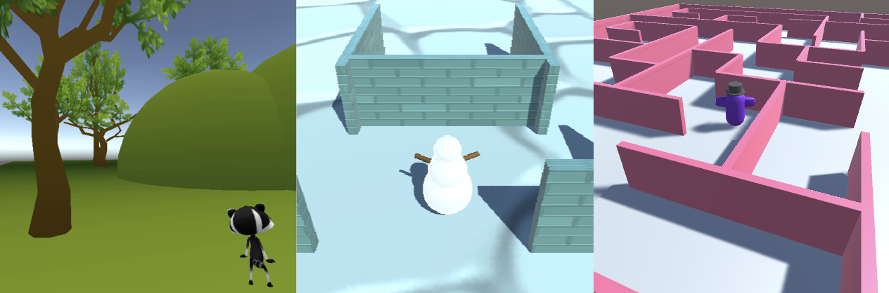

## Wat ga je maken

Gebruik je Unity-vaardigheden om een 3D-wereld te ontwerpen en te bouwen met een personage naar keuze.

Op deze wereld bouw je verder op de volgende twee projecten in het traject [Inleiding tot Unity](https://projects.raspberrypi.org/en/raspberrypi/unity-intro){:target='_blank'}.

Dit project wordt je aangeboden met steun van [Unity Technologies](https://unity.com/){:target="_blank"}.  Deze [projecten](https://projects.raspberrypi.org/en/pathways/unity-intro){:target="_blank"} bieden jongeren de kans om hun eerste stappen te zetten in het maken van virtuele werelden met gebruik van Real-Time 3D.

**World building** laat je je fantasie gebruiken om een omgeving te bedenken en deze dan tot leven te laten komen. World building can involve storytelling, visual design, map making, and character design. In Unity kun je een 3D-wereld bedenken en deze vervolgens zo maken dat anderen deze kunnen ervaren. 

Je gaat:
+ Een 3D Player-personage kiezen (gebruik een meegeleverd model of maak er zelf een met 3D GameObjects)
+ Een 3D-omgeving bouwen met behulp van 3D GameObjects en Particle Systems
+ De camera-instellingen en de manier van bewegen bepalen voor je personage

--- no-print ---

### Afspelen ▶️

--- task ---

Klik op het ingesloten project en navigeer door deze voorbeeld wereld.

Denk na over de GameObjects, inclusief hun vorm, materialen en posities.
+ Past het personage bij het thema?
+ Hoe zijn de elementen (zoals bijvoorbeeld muren) gemaakt?

[Sneeuwscène](https://raspberrypilearning.github.io/unity-webgl/SnowSceneWeb){:target='_blank'} 

<iframe allowtransparency="true" width="710" height="450" src="https://raspberrypilearning.github.io/unity-webgl/SnowSceneWeb" frameborder="0"></iframe>

{:width="400px"}

--- /task ---

### Doe inspiratie op 💭

Je gaat een aantal ontwerpbeslissingen nemen om je wereld te creëren.

--- task ---

Bekijk deze voorbeeldprojecten om meer ideeën op te doen:

[Try the Maze world](https://raspberrypilearning.github.io/unity-webgl/maze-world-builder){:target='_blank'}. {:width="400px"}

[Try the Hills and trees world](https://raspberrypilearning.github.io/unity-webgl/HillsandTrees){:target='_blank'}. {:width="400px"}

--- /task ---

--- /no-print ---

--- print-only ---

### Doe inspiratie op 💭

Je gaat een aantal ontwerpbeslissingen nemen om je wereld te creëren.

Bekijk deze voorbeeldprojecten om meer ideeën op te doen:

Snow scene: https://raspberrypilearning.github.io/unity-webgl/SnowSceneWeb {:width="400px"}
Maze world: https://raspberrypilearning.github.io/unity-webgl/maze-world-builder {:width="400px"}
Hills and trees: https://raspberrypilearning.github.io/unity-webgl/HillsandTrees {:width="400px"}

--- /print-only ---

Om te ontdekken hoe deze projecten tot stand zijn gekomen. download en unzip de [Unity packages](https://rpf.io/p/en/world-builder-get){:target='_blank'} en importeer ze dan een voor een in een nieuw 3D Unity project.

[[[unity-create-3d-project]]]

[[[unity-importing-a-package]]]
