## Het thema van je wereld

Hoe zal jouw wereld eruit zien? Het materiaal dat je voor de grond kiest, zal de sfeer bepalen en daarnaast kies of maak je een spelerspersonage. 

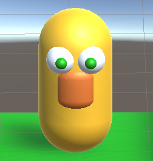{:width="300px"}

--- task ---

Denk na over het soort wereld dat je wilt maken:

+ Wat voor soort bioom, habitat, geografie of weersysteem zal het hebben?
+ Is het gebaseerd op een bestaande plek in de echte wereld, op een denkbeeldige planeet, of op een boek of film die je leuk vindt?

Bedenk een **naam** voor jouw wereld.

--- /task ---

--- task ---

**Kies:**

Open je Introductie tot Unity project met scènes die je hebt gemaakt in de drie Verken projecten in dit pad.

Of

Download en unzip het [Unity starter package](https://rpf.io/p/nl-NL/world-builder-go){:target="_blank"} op je computer. Kies een geschikte locatie, zoals bijvoorbeeld je map Documenten. Maak een nieuw 3D Unity-project en importeer het startpakket.

[[[unity-create-3d-project]]]

[[[unity-importing-a-package]]]

--- /task ---

--- task ---

**Kies:**

Je kunt een nieuwe lege scène in het project maken, of een kopie van je Sterren verzamelaarscène met een nieuwe naam opslaan.

Geef de nieuwe scène de naam van jouw wereld.

--- collapse ---

---
title: Maak een nieuwe scène
---

Klik op **File** en vervolgens op **New Scene**.

--- /collapse ---

--- collapse ---

---
title: Sla een kopie van een bestaande scène op
---

Klik met de rechtermuisknop op je **NPC scene** en kies **Save As**.

Verwijder alle GameObjecten die je niet wilt in je nieuwe wereld. Als je denkt dat je later een GameObject toch wilt gebruiken kan je het nu deactiveren door het selectievakje naast zijn naam in de Inspector uit te vinken.

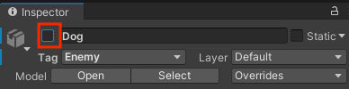

--- /collapse ---

--- /task ---

Je wereld of kaart heeft een vloer of grond nodig waarop de speler kan lopen.

--- task ---

Als je vanuit een nieuwe scène begint, voeg dan een vlak voor de vloer toe. Als je aan een bestaande scène werkt, kun je gewoon het materiaal of de grootte wijzigen.

--- collapse ---

---
title: Voeg een vlak toe
---

Klik met de rechtermuisknop op je scène in het Hierarchy venster en selecteer **GameObject** en vervolgens **3D Object** en vervolgens **Plane**.

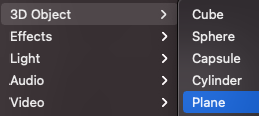

Het standaardformaat voor het vlak is 10m × 10m. Unity gebruikt meters als meeteenheid.

Je kunt de x en z Scale eigenschappen voor de Transform van het vlak wijzigen in de Scène weergave of in de Inspector.

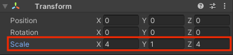

--- /collapse ---

[[[unity-terrain-object]]]

Voeg materiaal toe aan je vloer of wijzig het zodat het past bij de wereld die je aan het ontwerpen bent.

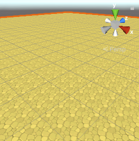

[[[unity-material-with-texture]]]

--- /task ---

Wat voor soort personage zal de Speler in je wereld zijn? We hebben enkele dieren en auto model voorwerpen al toegevoegd waar je uit kunt kiezen. Eventueel kun je zelf een personage maken van een 3D GameObject met onderliggende objecten die samen bewegen.

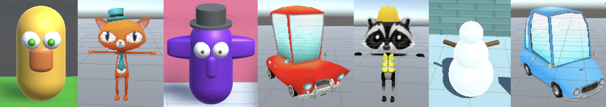

--- task ---

Als je een kopie hebt gemaakt van een bestaande scène, maar een ander spelerspersonage wilt:
+ Sleep de Main Camera van de bestaande speler naar het hoogste niveau in de Hierarchy, en
+ Verwijder dan het Player GameObject.

Modellen kunnen worden gemaakt in 3D-modelleringstools zoals Blender. Je kunt bestaande modellen ook hergebruiken als je toestemming hebt. Om tijd te besparen, raden we je aan om één van de meegeleverde modellen te gebruiken, of om je eigen GameObject te ontwerpen met behulp van 3D vormen in Unity.

**Kies:**

--- collapse ---

---
title: Maak een GameObject van een model
---

Navigeer naar het model dat je wilt gebruiken in het projectvenster.

Sleep het model naar je scène.

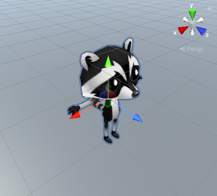

Noem het nieuwe GameObject `Player` en voeg de Playertag toe.

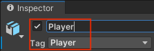

Pas de startpositie van de Transform van de speler aan.

Als je de Cat of Raccoon gebruikt, kies dan welke accessoires je wilt gebruiken, alles wat je niet wil gebruiken schakel je uit door het vinkje naast hun naam in de Inspector uit te vinken.

--- /collapse ---

--- collapse ---

---
title: Maak een GameObject van 3D-vormen
---

Maak een 'Empty' 3D-object voor de speler.

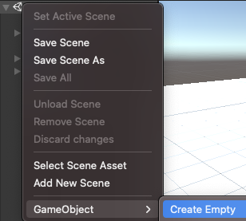

Noem het nieuwe GameObject `Player` en voeg de Playertag toe.

Klik met de rechtermuisknop op de speler en voeg andere 3D-vormen toe vanuit **Create** > **3D Object** als onderliggende GameObjects. De onderliggende objecten zullen meebewegen met het Player GameObject.

Dit personage heeft een 'Capsule'-lichaam met onderliggende GameObjects die 'Spheres' en 'Cylinders' zijn. De vormen hebben de naam gekregen van het lichaamsdeel dat ze voorstellen.

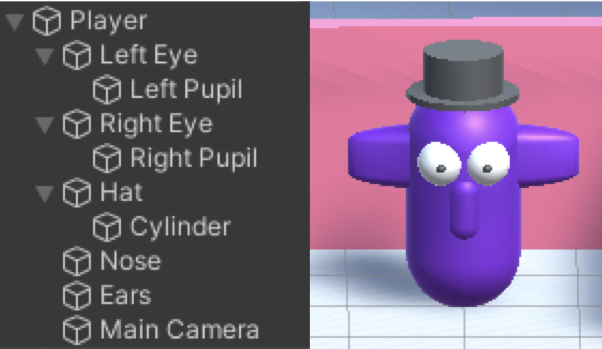{:width="400px"}

--- /collapse ---

--- /task ---

--- task ---

**Fouten oplossen:**

[[[unity-assign-material]]]

--- collapse ---

---
title: De textuur van het materiaal is te groot of te klein
---

Je kunt de **Tiling** eigenschappen wijzigen voor het materiaal of voor materiaal dat in een GameObject wordt gebruikt. Kies grotere nummers om een kleiner patroon te creëren.

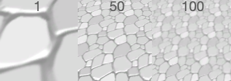

--- /collapse ---

--- collapse ---

---
title: Ik heb de camera verwijderd!
---

Als je Camera een onderliggend object is van de Speler en je de speler verwijdert, dan verwijder je ook de camera.

Om een nieuwe camera toe te voegen, klik je met de rechtermuisknop in de Hierarchy en kies Camera.

Je kunt deze camera slepen naar de Player zodat het een onderliggend object wordt en de instellingen aanpassen.

--- /collapse ---

--- /task ---

--- save ---
