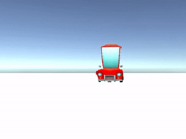

## Bediening voor je speler

De speler moet jouw personage kunnen besturen, zodat hij door jouw wereld kan bewegen. 

{:width="300px"}

--- task ---

**Kies:** Hoe beweegt jouw speler?
+ Als je voor het Cat- of Raccoon-model hebt gekozen, kun je je PlayerController-bewegingsscript en IdleWalk-animator opnieuw gebruiken.
+ Als je voor het Car01- of Car02-model hebt gekozen, kun je je PlayerController-bewegingsscript hergebruiken en de bijpassende Car1- of Car2-animators gebruiken.
+ Als je je eigen speler hebt gemaakt, dan kun je je eigen simple movement script maken zonder animatie.

--- collapse ---

---
title: Voeg het PlayerController script toe voor een Cat, Raccoon of Rat
---

Selecteer je **Player GameObject** en klik dan op **Add Component** in de Inspector en kies **Character Controller**.

Vind je **IdleWalk Animator** in de map Animation folder in het projectvenster, selecteer het **Player GameObject** en sleep de **Animator** naar de Inspector.

Als je bent begonnen vanuit een project dat het PlayerController-script bevat, kun je het toevoegen aan een nieuw personage GameObject. Zoek het **PlayerController** script in het projectvenster, selecteer het **Player GameObject** en sleep het script naar de Inspector.

**Tip:** Je kunt het script en de animator ook vanuit het projectvenster naar het Player GameObject in de Hierarchy slepen. Zorg ervoor dat je het naar het juiste GameObject sleept.

Als je het PlayerController-script niet hebt, selecteer dan het **GameObject** van je personage en klik op **Add Component** en maak een script met de naam `PlayerController` met dit script:

--- code ---
---
language: csharp
filename: PlayerController.cs
line_numbers: false
line_number_start: 
line_highlights: 
---
using System.Collections;
using System.Collections.Generic;
using UnityEngine;

public class PlayerController : MonoBehaviour
{
    public float snelheid = 3.0f;
    public float draaiSnelheid = 1.0f;
    Animator anim;

    void Start()
    {
        anim = gameObject.GetComponent<Animator>();
    }
    
    void Update()
    {
        float bewegingsSnelheid = snelheid;
    
        if (Input.GetAxis("Vertical") > 0)
        {
            anim.SetBool("forward", true);
        }
        else if (Input.GetAxis("Vertical") < 0)
        {
            anim.SetBool("forward", false);
            bewegingsSnelheid *= 0.5f;
        }
        else
        {
            anim.SetBool("forward", false);
        }
    
        CharacterController controller = GetComponent<CharacterController>();
        transform.Rotate(0, Input.GetAxis("Horizontal") * draaiSnelheid, 0);
        Vector3 forward = transform.TransformDirection(Vector3.forward);
        float curSnelheid = bewegingsSnelheid * Input.GetAxis("Vertical");
        controller.SimpleMove(forward * curSnelheid);
    }
}

--- /code ---

--- /collapse ---

[[[unity-player-character-controller]]]

[[[unity-animation]]]

--- /task ---

--- task ---

**Test:** Probeer in de Play modus enkele bewegingen en controleer zo of je personage kan bewegen.

Pas de snelheidsinstellingen (speed) aan om het juiste effect voor je personage te krijgen.

**Tip:** Als je de snelheidseigenschappen (speed) in de Inspector verandert, dan worden deze waarden gebruikt in plaats van de standaardwaarden. Standaardwaarden zijn handig als je het script in andere scènes of projecten wilt hergebruiken.

[[[unity-console-error]]]

--- collapse ---

---
title: Mijn personage beweegt niet
---

+ Controleer of je in de Play modus staat (via de kleurtint) en of je de cursor over de spelweergave houdt.
+ Controleer op eventuele fouten in de Console. Als er fouten zijn in GameObjects die je niet gebruikt, zoals NPC's, dan kun je de NPC's verwijderen (je kunt ze kopiëren van een andere scène als je ze later toch wilt gebruiken).
+ Zorg ervoor dat het SimpleController-script is gekoppeld aan het Player GameObject (en niet aan een ander GameObject).
+ Zorg ervoor dat de parameternaam die voor de Animator wordt gebruikt hetzelfde is als de parameternaam in je script. In het bovenstaande voorbeeld wordt `isRunning` gebruikt als de parameternaam.

--- /collapse ---

--- /task ---

--- task ---

Je hoeft de camera de speler niet te laten volgen, maar het is vaak beter om het wel te doen.

[[[unity-camera-follow-player]]]

--- /task ---

--- task ---

**Test:** Speel je scène en zorg ervoor dat de camera de speler volgt.

Je kan altijd later nog de camera-instellingen aanpassen als je landschap helemaal klaar is.

--- /task ---

--- task ---

**Fouten oplossen:**

Handige tips om fouten op te sporen:
- Schakel de Playl modus tint in zodat je kunt zien wanneer je in Game modus bent.
- Klik op **Gizmos** in de Play modus en klik vervolgens op een GameObject in de Inspector om zijn colliders te bekijken.
- Check de waarden van public variables in de Inspector in de Play modus om te zien hoe ze veranderen.
- Gebruik `Debug.Log()` om berichten af te drukken naar de Console om te begrijpen wat er aan de hand is.
- Controleer de Console op fouten. Fouten in een script worden ook weergegeven in de balk onderaan de editor.

[[[unity-camera-error]]]

[[[unity-changes-gone]]]

[[[unity-method-absent]]]

[[[unity-show-variables]]]

--- /task ---

--- save ---
