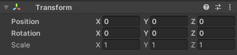

## Bouw een landschap

Nu kun je de plattegrond van je wereld uitbouwen met landschappen en particle systems. 

{:width="300px"}

--- task ---

Gebruik 3D-vormen om trappen of heuvels aan je wereld toe te voegen en zo verschillende niveaus te creëren die je speler kan verkennen.

--- /task ---

--- task ---

De Character Controller component heeft eigenschappen waarmee het personage hellingen en trappen kan beklimmen.

--- collapse ---

---
title: Trappen en hellingen met de Character controller
---

Met de Character Controller kan een GameObject hellingen en traptreden beklimmen.

Je kunt de instellingen aanpassen om het gedrag te besturen:
+ **Slope Limit**: Het personage loopt hellingen op die minder zijn dan dit aantal graden.
+ **Step Offset**: het personage zal trappen lopen die minder zijn dan deze hoogte.

De standaardinstellingen zullen prima zijn voor veel situaties.

**Tip:** Lopen op oppervlakken is gebaseerd op colliders, niet op de zichtbare delen van het GameObject. Als je onverwacht gedrag tegenkomt, klik dan op Gizmos in de Game weergave om de colliders te bekijken tijdens het testen van je spel.

--- /collapse ---

--- /task ---

--- task ---

**Test:** Speel je scène af en probeer de hellingen of trappen op te lopen die je hebt gemaakt.

Pas de Character Controller-instellingen of je landschap aan om het gewenste effect te krijgen.

**Fouten oplossen:**

--- collapse ---

---
title: Mijn personage loopt in de lucht!
---

Tip: Lopen op oppervlakken is gebaseerd op colliders, niet op de zichtbare delen van de GameObjects. Als je onverwacht gedrag tegenkomt, klik dan op Gizmos in de Game weergave om de colliders te bekijken tijdens het testen van je spel.

Pas de colliders aan zodat het personage dicht genoeg bij het oppervlak kan komen om erop te lopen.

Als je een bol maakt, zal deze een sphere collider hebben, dus stel de x-, y- en z-Scale in op hetzelfde getal.

--- /collapse ---

--- /task ---

--- task ---

Voeg nu wat meer decors toe aan je wereld.

Je kunt een van de bestaande modellen gebruiken, 3D-objecten of een combinatie daarvan.

[[[unity-3d-objects]]]

[[[unity-material-with-texture]]]

We hebben Car, Tree en andere modellen opgenomen die als decor in jouw wereld kunnen worden gebruikt.

--- collapse ---

---
title: Model objecten toevoegen aan een scène
---

Navigeer naar een model in het projectvenster, sleep het naar de scène weergave om het toe te voegen aan je scène.

Je kunt de Transform van de GameObjects die je maakt aanpassen om hun positie (position), rotatie (rotation) en schaal (scale) te wijzigen.

--- /collapse ---

[[[unity-scene-top-down]]]

[[[unity-scene-navigation]]]

[[[unity-physics-colliders]]]

--- /task ---

--- task ---

**Test:** Speel je scène af en loop erin rond. Misschien wil je de camerahoek aanpassen zodat deze goed past bij de landschappen die je hebt gekozen.

--- /task ---

Particle Systems zijn een geweldige manier om je wereld tot leven te brengen.

--- task ---

Bedenk of particle effects jouw wereld interessanter kunnen maken. Ze kunnen worden gebruikt om voorwerpen te laten schitteren, om weerseffecten te creëren of om een vulkaan te laten uitbarsten.

[[[unity-particle-system]]]

--- /task ---

Achtergrondmuziek is een andere manier om sfeer toe te voegen aan een wereld.

--- task ---

De MusicLoop1 en MusicLoop2-geluiden zijn geschikt voor achtergrondmuziek, of je kunt er zelf een toevoegen.

[[[unity-add-soundtrack]]]

[[[unity-import-sounds]]]

--- /task ---

--- task ---

**Fouten oplossen:**

--- collapse ---

---
title: De cameraweergave werkt niet goed voor de scène
---

Pas de Transform Position en Rotation van de camera aan om het gewenste camerabeeld te krijgen.

--- /collapse ---

[[[unity-collider-error]]]

--- /task ---

--- save ---
