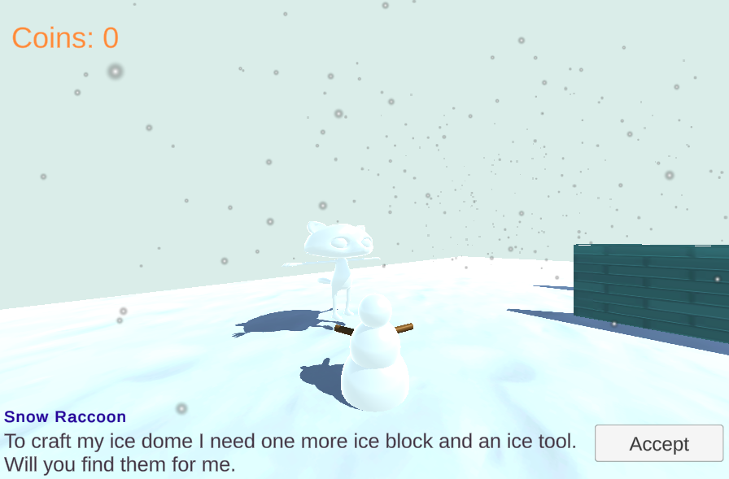

## Wat kun je verder nog doen?

Als je het [Inleiding tot Unity](https://projects.raspberrypi.org/nl-NL/raspberrypi/unity-intro){:target='_blank'}-pad volgt, kun je doorgaan naar het [ Speurneuzen](https://projects.raspberrypi.org/nl-NL/projects/quest-seeker){:target='_blank'}-project. In dit project maak je een minigame of verhaal met NPC's die de speler opdrachten geven om te voltooien.

--- print-only ---

Sneeuwscène: https://raspberrypilearning.github.io/unity-webgl/SnowQuest 

--- /print-only ---

--- no-print ---
<iframe allowtransparency="true" width="710" height="450" src="https://raspberrypilearning.github.io/unity-webgl/SnowQuest/" frameborder="0"></iframe>

--- /no-print ---

***

Dit project werd vertaald door vrijwilligers:

Iny van Beuningen
Arnout Cator

Dankzij vrijwilligers kunnen we mensen over de hele wereld de kans geven om in hun eigen taal te leren. Jij kunt ons helpen meer mensen te bereiken door vrijwillig te starten met vertalen - meer informatie op [rpf.io/translate](https://rpf.io/translate).

